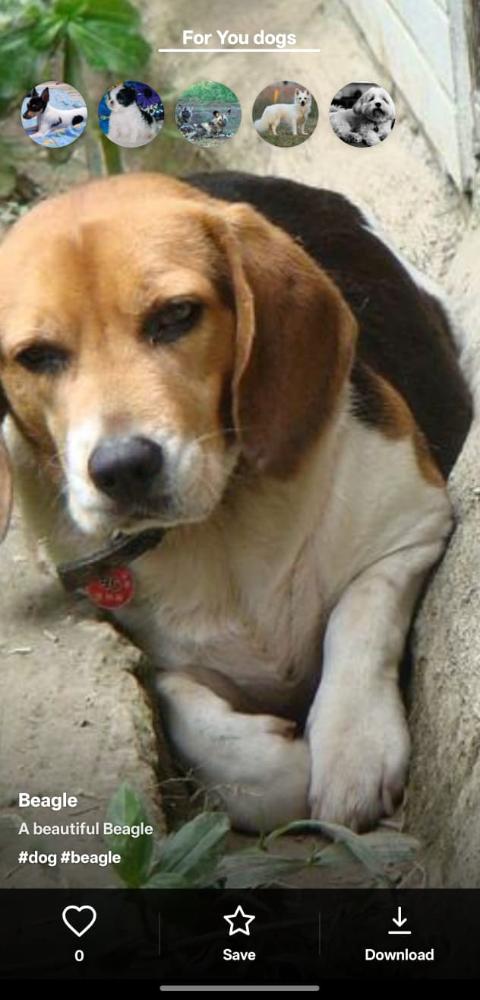
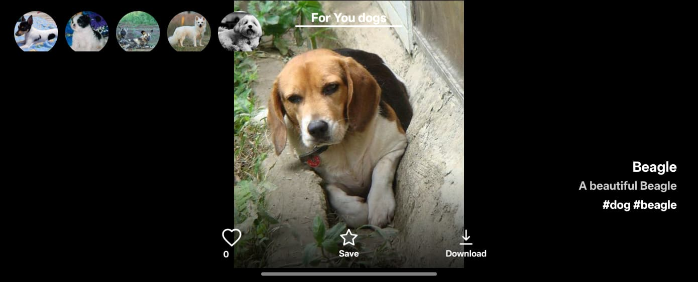
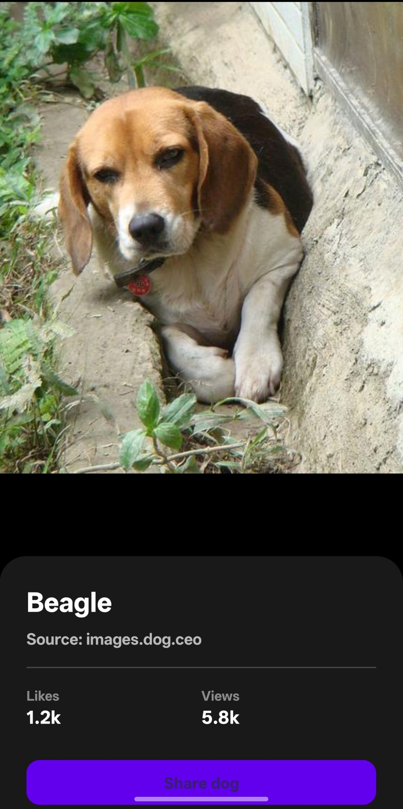

# DogFeed — Tik Tok para Cães

> **Unidade Curricular:** Desenvolvimento de Aplicações Móveis (DAM)  
> **Projeto:** Trabalho Prático 2 parte 3
> **Instituição:** ISEL · 2025/2026  
> **Ruben Zhang nº51388

---

## Descrição do Projeto

O **DogFeed** é uma aplicação móvel desenvolvida para Android que implementa uma
galeria de imagens com navegação vertical. A aplicação adota a interface do TikTok, onde cada imagem
ocupa a totalidade do viewport, permitindo uma interação fluida através de gestos de deslizamento
oara baixo.

### Objetivo e Propósito

O propósito fundamental deste projeto assenta na aplicação de conceitos, nomeadamente:

- Implementação do padrão arquitetural **MVVM** (*Model-View-ViewModel*).
- Comunicação com um endpoint de uma API para obter JSON com imagens.
- Persistência de dados local como Cache e Favoritos.
- Download de imagens e partilha de links.

Sendo efetuado com auxilio do Antigravity IDE, como proposto no enunciado.

---

## Interface de Programação de Aplicações (API)

A aplicação consome a **Dog CEO API**, uma interface de programação pública e gratuita dedicada à
catalogação de imagens de cães.

| Especificação                       | Detalhe                                          |
|-------------------------------------|--------------------------------------------------|
| **Ponto de Extremidade (Endpoint)** | `GET https://dog.ceo/api/breeds/image/random/10` |
| **Formato de Dados**                | JSON                                             |
| **Autenticação**                    | Isento (Acesso Público)                          |
| **Documentação**                    | [dog.ceo/dog-api/](https://dog.ceo/dog-api/)     |

---

## Capturas de Ecrã (Screenshots)

|                         Feed Principal                          |                            Feed Landscape                            |                           Detalhe do Item                           |
|:---------------------------------------------------------------:|:--------------------------------------------------------------------:|:-------------------------------------------------------------------:|
|  |  |  |

---

## Instruções de Execução

Para compilar e executar o projeto em ambiente de desenvolvimento ou produção, siga os procedimentos
descritos abaixo:

### Pré-requisitos Técnicos

- **Android Studio:** Versão Ladybug (ou superior).
- **Android SDK:** API Level 24 (Android 7.0) como requisito mínimo.
- **Conetividade:** Acesso à Internet para o carregamento inicial de dados (suporta modo offline
  após cache).

1. **Orquestração via ViewModel (`ImageViewModel`):**
   Este componente atua como o mediador primordial, mantendo o estado da interface (coleção de
   imagens, estados de erro e indicadores de carregamento). Ao ser instanciado, solicita ao
   repositório o provimento de novos dados, expondo-os à `MainActivity` através de objetos
   observáveis (`LiveData`). Esta abordagem garante a **persistência do estado** perante alterações
   de configuração do sistema (como a rotação do dispositivo), mitigando a perda de informação
   .

2. **Abstração e Mediação de Dados (`ImageRepository`):**
   Implementa o padrão *Repository*, funcionando como um broker de informação. Este componente
   decide, de forma transparente para o `ViewModel`, se a informação deve ser obtida remotamente via
   `DogApiService` (através da biblioteca Retrofit) ou recuperada da `ImageCache` local. Esta
   decisão é balizada pelo `NetworkMonitor`, que observa em tempo real o estado da conetividade de
   rede, permitindo uma transição suave entre o modo online e a consulta de dados persistidos.

3. **Apresentação e Reatividade (`MainActivity` & Adaptadores):**
   A `MainActivity` subscreve-se aos fluxos de dados do `ViewModel`. Quando ocorre uma mutação na
   lista de imagens, o `ImageFeedAdapter` utiliza o algoritmo `DiffUtil` para atualizar a vista, minimizando o custo computacional de redesenho da interface. A transição para
   a `ImageDetailsActivity` é efetuada através do encapsulamento de um objeto `ImageItem` num
   `Intent` serializável, assegurando a integridade do contexto informativo entre ecrãs.

4. **Subsistemas de Persistência e Suporte:**
    * **`FavoritesManager`:** Gere a lista de preferências utilizando `SharedPreferences`.
      Implementa uma política de despejo **FIFO (First-In, First-Out)**, garantindo que a coleção de
      favoritos respeite os limites impostos, removendo automaticamente o registo mais antigo
      perante a inserção de um novo elemento quando o limite é atingido.
    * **`ImageCache`:** Providencia um mecanismo de armazenamento em memória e disco, permitindo que
      a aplicação exiba conteúdos previamente visualizados mesmo em cenários de ausência total de
      sinal de rede.

### Dinâmica de Execução (Ciclo de Vida de um Pedido)

O fluxo operacional inicia-se com a submissão de um pedido de renovação (*Refresh*) ou através da
paginação automática (*Lazy Loading*). O `ViewModel` despoleta uma corrotina assíncrona (contexto
`IO`) que interroga o repositório. Uma vez obtida a resposta — seja por via de uma chamada HTTP
bem-sucedida ou por recuperação de cache — os dados brutos são mapeados para objetos de domínio (
`ImageItem`). Estes são então propagados para a camada de visualização, onde os adaptadores se
encarregam da renderização final e da gestão de eventos tácteis (como o duplo toque para "Gosto"),
fechando o ciclo reativo da aplicação.

---

## Arquitetura e Estrutura

A aplicação está estruturada para garantir a escalabilidade e a manutenção do código,
separando a lógica de negócio da interface de utilizador:

### Procedimento de Instalação e Corrida

1. Efetue a importação do projeto no **Android Studio**.
2. Sincronize o sistema de build **Gradle** para garantir a resolução de todas as dependências.
3. Utilize o comando de compilação via terminal:
   ```bash
   ./gradlew assembleDebug
   ```
4. Implemente a aplicação num dispositivo físico ou emulador através do botão **Run** (▶) no IDE.
