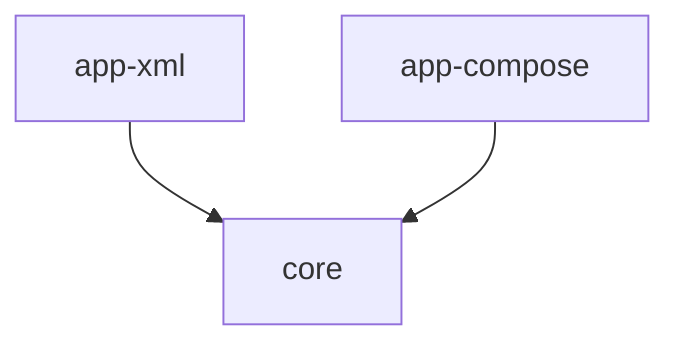

# Arquitetura do Software - DogFeed Modular

O projeto segue uma arquitetura multi-módulo para promover a reutilização de código e a separação de responsabilidades.

## Estrutura de Módulos

- **`:core`**: Módulo de biblioteca Kotlin/Android que contém:
    - Modelos de dados (`ImageItem`).
    - Cliente de API (`DogApiService`).
    - Repositório central (`ImageRepository`).
    - Gestão de persistência (`FavoritesManager`).
    - Monitorização de rede (`NetworkMonitor`).
- **`:app-xml`**: Aplicação Android utilizando a stack clássica:
    - UI baseada em XML Views (ViewPager2, RecyclerView).
    - ViewModel com `LiveData`.
- **`:app-compose`**: Aplicação Android utilizando a stack moderna:
    - UI baseada em Jetpack Compose (`VerticalPager`).
    - ViewModel com `StateFlow` e `Compose State`.

## Diagrama de Dependências

## Padrão: MVVM (Model-View-ViewModel)

Ambos os módulos de aplicação seguem o padrão MVVM, consumindo a camada de repositório do módulo `:core`.

### Camadas
- **UI (View)**: Renderização de dados e captura de eventos (Like, Save, Download).
- **ViewModel**: Gestão de estado da UI e ponte para o Repositório.
- **Repository (Core)**: Fonte única de verdade para os dados das imagens.
- **Data Source (Core)**: Implementação do cliente API (Retrofit).

### Fluxo de Dados:
UI ↔ ViewModel ↔ Repository (Core) ↔ API Service (Core)
